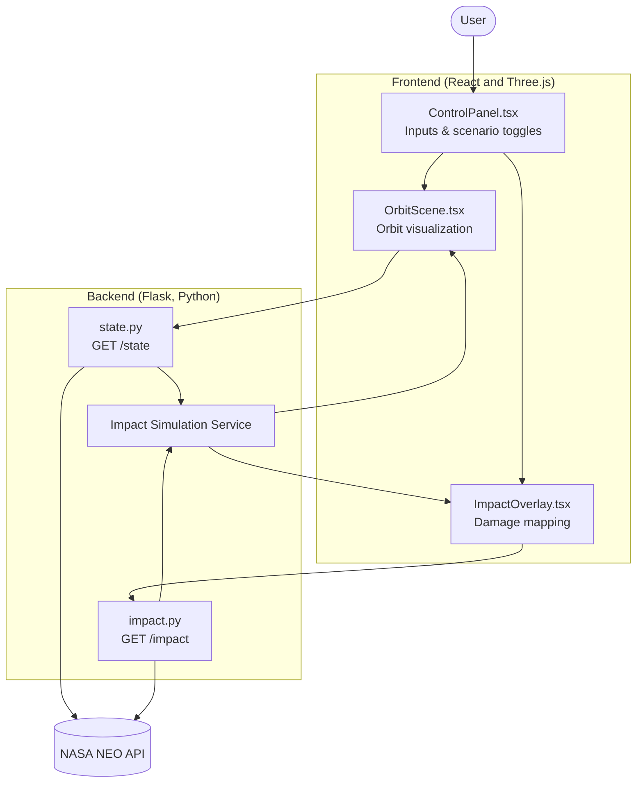

# Meteor Madness: Asteroid Impact Simulator 🚀
Interactive NASA dataset–driven simulation tool for modeling asteroid impacts and mitigation strategies.

**[View the 2025 NASA Space Apps Challenge](https://www.spaceappschallenge.org/2025/challenges/meteor-madness/)**

Team: [NEOlytics](https://www.spaceappschallenge.org/2025/find-a-team/neolytics/)

## Overview
Meteor Madness is a web-based simulation and visualization tool built for the 2025 NASA Space Apps Challenge.

It helps users explore near-Earth asteroid threats by pulling real NASA NEO orbital data and combining it with impact models to predict:
* Trajectory and orbital path
* Impact timing and location
* Crater size and effect radius
* Thermal and overpressure damage zones
* Airburst scenarios vs direct Earth impacts

The goal is to make complex planetary defense science accessible to everyone.

## Key Features
* Live asteroid state vectors fetched from NASA data (NASA Neo API)
* Interactive 3D orbit visualization using Three.js
* Real-time simulation of energy, destruction radius, and risk level
* Toggle reference frame (geocentric vs heliocentric)
* UI controls for asteroid parameters and scenario exploration
* Map-based overlays for impact footprints

**Add-ons:**
* Mitigation strategies (deflection modeling)
* Population and seismic risk overlays
* “Defend Earth” mini-game mode


### System Overview



**Interaction flow:**
User -> Frontend -> Flask API -> Physics Simulation -> Visual Updates

## REST API
This section details the behavior of the primary simulation endpoints, particularly regarding their use of geocentric (Earth-centered) and heliocentric (Sun-centered) coordinate frames.

### GET /impact
* **Speed Source:** Uses **geocentric** (Earth-relative) speed.
* **Primary Data:** Pulls from the `NeoWs` `relative_velocity` field for known Earth close approaches.
* **Fallback:** If `relative_velocity` is unavailable, the simulation defaults to a 20 km/s entry speed.
* **Note:** While energy and crater size are frame-invariant for a *given* speed, this endpoint's speed calculation is fundamentally geocentric.

### GET /damage
* **Speed Source:** Directly uses the final velocity calculated by the `/impact` endpoint.
* **Frame:** All damage calculations (thermal/overpressure radii, yield, crater size) are based on the **geocentric** (Earth-relative) entry speed.

### GET /impact_point
* **Frame:** This endpoint is explicitly **geocentric**.
* **Method:** It calculates a straight-line path (asteroid state minus Earth state), rotates this vector into an ECEF (Earth-Centered, Earth-Fixed) frame, and outputs the final `lat/lon` impact coordinate.

### GET /deflect_kinetic
This endpoint uses a mixed-frame model, which is standard for mission planning:
* **Output Velocity:** The returned `pre/post velocity` is in the frame you request (e.g., `frame=geo` or `frame=helio`). Defaults to **geocentric**.
* **Deflection Basis:** The *direction* of the deflection (e.g., `mode=prograde`, `radial`, `normal`) is defined using the **heliocentric** state. This ensures "prograde" always means "along the orbit around the Sun."
* **Orbital Effects:** The approximate orbital changes (`Δa`, `ΔP`) are calculated in **heliocentric** terms (i.e., change in semi-major axis and period around the Sun).

### GET /deflection_dashboard
* **Frame:** Follows the same logic as `/deflect_kinetic`.
* **Direction Basis:** Deflection direction (`prograde`, etc.) is set **heliocentrically**.
* **Output Orbits:** Returns *both* sampled heliocentric and geocentric orbits so the React frontend can toggle between reference frames.
Response examples available in `/docs/api_samples`

## Data & Physics Modeling
* NASA NEO orbital elements → state vectors
* Kinetic energy → TNT equivalent
* Crater scaling laws (if surface impact)
* Thermal and overpressure radius estimation
* Probability-based outcome classification (airburst vs ground impact)

**Libraries used:**
* NumPy
* PyEphem
* GeoJSON utilities

## Tech Stack
| Layer | Tech |
|---|---|
| Frontend | React (TSX), Three.js (react-three-fiber), HTML/CSS |
| Backend | Flask (Python), NumPy |
| Data | NASA NEO API, potential USGS overlays |
| DevOps | Docker (optional), GitHub Actions |
| Tools | Postman, VSCode |

## Running Locally

### Backend
```sh
pip install -r requirements.txt
flask run --port 5050
```

### Frontend
```sh
npm install
npm run dev
```
